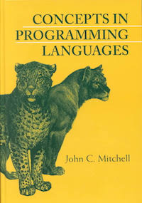
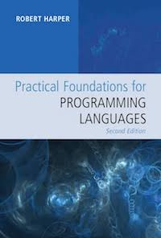
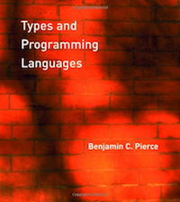
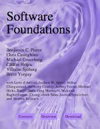

# CSCI 3366 Programming Languages

## OCaml Textbooks and Tutorials

There are a number of free OCaml tutorials and books that can supplement the coverage in class and provide material for those who wish to learn more.

[OCaml.org Tutorials](https://ocaml.org/learn/tutorials/) 

These tutorials cover different aspects of the language and supporting tools (build managers, debuggers, profilers).

[OCaml Language Manual](https://ocaml.org/releases/4.11/htmlman/index.html)

The official language manual is surprisingly readable, and Part I gives a nice introduction to the language and its various features. Chapter 3 covers OCaml's object system, which we won't make use of in this course, so you can skip that.

[Real World OCaml](https://dev.realworldocaml.org/), by Yaron Minsky, Anil Madhavapeddy, and Jason Hickey.

A very comprehensive book (with free online version). Be aware that the book uses an alternative standard library called Base, which we won't be using. However, you can still learn a lot about the language and its features by reading the book.

[Using, Understanding, and Unraveling the OCaml Language](http://caml.inria.fr/pub/docs/u3-ocaml/), by Didier Remy.

For those who want to understand some of the theoretical aspects of the design of OCaml and its features, these lecture notes provide an introduction. This is probably best appreciated after completing the course.

## PL Textbooks

Below is a list of recommended supplemental textbooks suggested by Prof. Muller from previous offerings of this course:
This course is largely self-contained but it would be helpful to read a textbook on the subject to get another perspective and to broaden your understanding. Of the books listed below Mitchell's book is fairly widely used for undergraduate courses in programming languages.  The other books are a little more advanced and more commonly used for first-year graduate students. All are truly excellent.

---

[Concepts in Programming Languages](http://theory.stanford.edu/~jcm/books.html), by John C. Mitchell. *(Recommended)*

This is an excellent overview of programming languages by one of the leaders in the field. It was developed for an undergraduate course on programming languages taught at Stanford. Our course will not follow this book directly, but there is a good deal of overlap and the book can add a lot to your understanding of programming languages.

CIPL is on reserve in the O'Neill Library and it is available through [Amazon](http://www.amazon.com/gp/product/0521780985/ref=olp_product_details?ie=UTF8&me=&seller=), \$82 new, \$47 used.

.

.

---

[Practical Foundations for Programming Languages](https://www.cs.cmu.edu/~rwh/pfpl/), by Robert W. Harper. *(Advanced Study, Not required but highly recommended)*

This is the comprehensive vision of programming languages and software by the single most knowledgable person in the world on the subject. To quote the author, his aim for the book: "a comprehensive framework for formulating and analyzing a broad range of ideas in programming languages. If language design and programming methodology are to advance from a trade-craft to a rigorous discipline, it is essential that we first get the definitions right. Then, and only then, can there be meaningful analysis and consolidation of ideas." Anything at all by Harper is worth reading carefully. PFPL is available through Cambridge University Press or through Amazon.

There is a free abridged version available through [the author's website](https://www.cs.cmu.edu/~rwh/pfpl/).

---

[Types and Programming Languages](http://www.cis.upenn.edu/~bcpierce/tapl/), by Benjamin C. Pierce. *(Advanced Study)*

TAPL is an excellent but more advanced book by another leader in the field.  TAPL provides a more theoretical and less implementation-oriented approach to PL than our course. It would be a good entree to graduate study in the field.

TAPL is on reserve in the O'Neill Library and is available through [Amazon](http://www.amazon.com/Types-Programming-Languages-Benjamin-Pierce/dp/0262162091) for about $65, a great investment for the serious computer science student.

.

---

[Software Foundations](https://www.cis.upenn.edu/~bcpierce/sf/current/index.html), by Benjamin C. Pierce, et. al. *(Advanced Study)*

Technically speaking, **Software Foundations** isn't a textbook for an undergraduate course in programming languages. But it is quite relevant. To quote the author, the book covers "... the mathematical underpinnings of reliable software. Topics include basic concepts of logic, computer-assisted theorem proving, the Coq proof assistant, functional programming, operational semantics, Hoare logic, and static type systems. The exposition is intended for a broad range of readers, from advanced undergraduates to PhD students and researchers. No specific background in logic or programming languages is assumed, though a degree of mathematical maturity will be helpful."

This book is [freely available](https://www.cis.upenn.edu/~bcpierce/sf/current/index.html).
